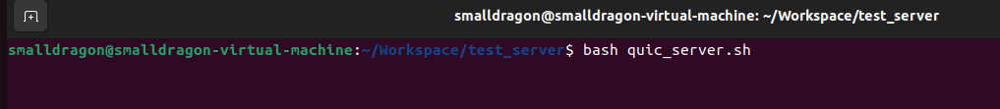
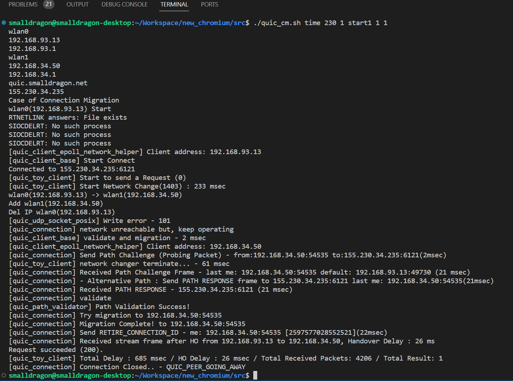
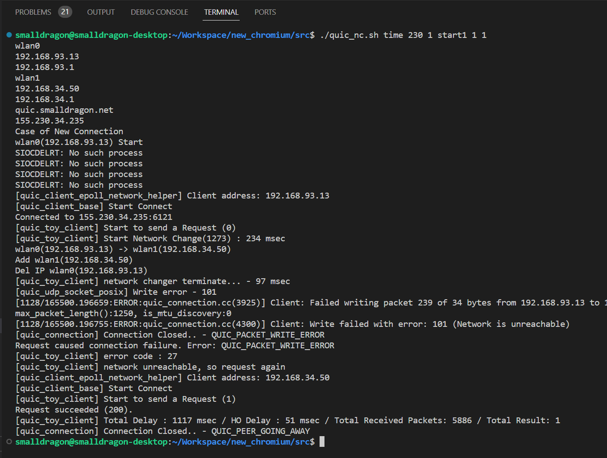

# mQUIC: Implementation

This is implementation of Paper "mQUIC: QUIC Handover with Connection Migration in Heterogenous Wireless/Mobile Networks". 

It allows the example itself to check connection condition and migrate connection when a handover occurs such as Wi-Fi to Cellular.

It is based on QUIC example which is included in chromium(quiche).

Considering that the Chromium source code is too large, It is distributed by porting the modified parts of the code. and, it is experimented in Ubuntu 20.04.4 LTS

It is recommended to prepare 2 of NICs to test handover between the NICs.


## Building mQUIC

To build mQUIC, you first download chromium source code.

chromium source code can download below link.

- https://chromium.googlesource.com/chromium/src/+/main/docs/linux/build_instructions.md

After the step of "Setting up the build" in the link, chromium version should be down to below commit for building mQUIC.

```bash
$ git checkout c91b87056
$ gclient sync
```

Now, It is complete to prepare the environment to install mQUIC. So, clone mQUIC in "chromium/src".

In mQUIC code, net has modified files of chromium QUIC code. and quic_client has configure files for simulating handover and porting the code, and quic_server has the files required to run quic server with index.html files of various sizes.

```bash
$ cd /path/to/chromium/src
$ git clone https://github.com/soyongkim/mQUIC.git
```

In quic_client, port_module.sh help to change original code to the modified code for mQUIC. also, back up the original file in net_backup folder.

```bash
$ cd mQUIC/quic_client
$ bash port_module.sh
```

If porting is successful, build the quic client and quic server binary.

```bash
$ cd /path/to/chromium/src
$ ninja -C out/Default epoll_quic_client epoll_quic_server
```

If you wants to restore the code, run rollback.sh

```bash
$ bash rollback.sh
```


## Run QUIC server

For testing handover, It is recommended to run the QUIC server in another computer.

send_server.sh helps to move about the files of QUIC server.

```bash
$ cd mQUIC
$ bash send_server.sh "IP_address" "Port"
```

After send the files to the computer, quic_server.sh run

```bash
$ bash quic_server.sh
```




## Run QUIC client

In quic_client, change*.sh and settings.yaml helps to make handover situation by modifying routing table.

Before run QUIC client, configure the settings.yaml.

In iface1 and 2, it sets the interface information to use handover. and server's host sets ip address of the server's one.

"Single" is used to test handover with only one wireless LAN card. it sets two ssid and password for using handover. 

```yaml
default:
  iface1:
    name: "wlan0"
    host: 192.168.93.13
    gateway: 192.168.93.1
  iface2:
    name: "wlan1"
    host: 192.168.34.50
    gateway: 192.168.34.1
  server:
    name: "quic.smalldragon.net"
    host: 0.0.0.0
  single:
    ssid1: "SSID-WiFi1"
    pass1: "PASSWORD"
    ssid2: "SSID-WiFi2"
    pass2: "PASSWORD"
```

To start the QUIC client, you can use quic_cm.sh and quic_nc.

quic_cm.sh uses connection migration and quic_nc.sh run the QUIC establishes new connection when handover.

```bash
$ bash quic_cm.sh time 200 1 start1 1 1

$ bash quic_nc.sh time 200 1 start1 1 1
```

on the command line:

```bash
$bash quic_cm.sh/quic_nc.sh [time | psn] [msec | EA] [number of handover] [start1 | start2 | start3 | start4] [number of requests] [number of testcases]

[time | psn]: time or received number of packets.

[msec | EA]: If "time" sets at the first argument, this is msec which is used to occur handover after the time. if "psn" sets at the first argument, this is EA which is used to occur handover after receiving the number of packets.

[number of handover]: number of handover, if 0 sets, handover doesn't occur.

[start1 | start2 | start3 | start4]: 
If "start1" sets, handover occurs from iface1 to iface2 in setting.yaml. If "start2" sets, handover occurs from iface2 to iface1.
If "start3" sets, handover occurs from ssid1 to ssid2 on single in setting.yaml.
If "start4" sets, handover occurs from ssid2 to ssid1.

[number of requests]: number of requests to server.

[number of testcases]: number of shellsctipt execution.
```

 *quic_cm.sh

*quic_nc.sh



