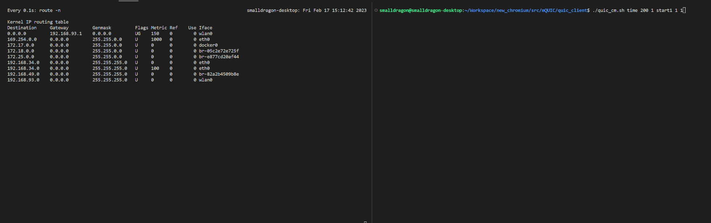

# mQUIC: Implementation

This is an implementation of the article titled 'mQUIC: Use of QUIC for Handover Support with Connection Migration in Wireless/Mobile Networks,' which explores the practical application of QUIC protocol for seamless handover support and connection migration in wireless and mobile networks.

The mQUIC(mobile QUIC) is designed with the following key requirements:

1) Handover detection based on an error event associated with data transmission, without relying on the underlying link-layer information; 
2) Fast detection of a handover by using an appropriate timer, when an error-based handover detection is not available; 
3) Obtaining a new IP address by routing table lookup, instead of establishing a new connection, for handover support; 
4) Handover support in networks with large handover delay; 
5) Performing the path validation and connection migration of QUIC with the server by using the new IP address.

The mQUIC implementation is rooted in the Chromium (quiche). It encompasses both adapted code derived from Chromium and a shell script that facilitates the application of this code onto the original Chromium (quiche). These components are collectively distributed.

Furthermore, the mQUIC implementation directly manipulates the routing table to emulate diverse handover scenarios. Thus, the execution of a handover experiment necessitates the presence of two Network Interface Cards (NICs).

This implementation has been validated on Ubuntu 20.04.4 LTS, with both the construction and distribution processes anchored within the Linux ecosystem. By adhering to these guidelines, the mQUIC implementation can be effectively harnessed to achieve seamless handover and connection migration capabilities.


## Building mQUIC: Chromium Source Code Integration

To initiate the construction of mQUIC, your first step is to acquire the Chromium source code. Access the Chromium source code by following the link provided below. Given its substantial size, it is advisable to ensure sufficient available storage space beforehand.

- https://chromium.googlesource.com/chromium/src/+/main/docs/linux/build_instructions.md

Upon completing the "Run the hooks" stage, the depot_tools will be installed, and the Chromium codebase will be fetched. However, considering the dynamic nature of the Chromium code, building the mQUIC implementation using the latest Chromium code may result in complications. Therefore, to align with the Chromium version compatible with mQUIC, you should revert the code to the specific commit point indicated below.

```bash
$ git checkout c91b87056
$ gclient sync
```

Once you have successfully reverted the Chromium codebase to the designated commit point, you can proceed with the installation of mQUIC. Navigate to the "src" directory within the Chromium codebase and clone the mQUIC repository using the following command:

```bash
$ cd /path/to/chromium/src
$ git clone https://github.com/soyongkim/mQUIC.git
```

Upon downloading mQUIC, you will find a "net" folder containing customized Chromium code segments tailored for mQUIC. To effectively integrate this code into the Chromium framework, execute the provided script as outlined below:

```bash
$ cd mQUIC
$ bash port_mquic.sh
```

Following the code porting process, a new directory named "net_backup" will emerge. This directory contains a copy of the original Chromium code. With the code successfully ported, you can now proceed to build Chromium with the integrated mQUIC. Assuming that Chromium and the accompanying gn tool are already installed, you can follow these steps:

1. Generate ninja build files using the gn tool:

```bash
$ cd /path/to/chromium/src
$ gn gen out/Default
```

2. Build the mQUIC client and server using the ninja build tool:

```bash
$ ninja -C out/Default epoll_quic_client epoll_quic_server
```

In the event you wish to revert to the original Chromium codebase, you can accomplish this by executing the provided "rollback.sh" script:

```bash
$ bash rollback.sh
```


## Running the QUIC server

For the purpose of conducting a handover experiment, it is essential to migrate the server to a different Linux device. This migration can be conveniently accomplished by executing the "send_server.sh" script.

"send_server.sh" orchestrates the seamless transfer of the compiled mQUIC components, along with the essential execution files such as certificates and index files, in addition to a script to initiate the server. It's important to note that if you had altered the desired folder name using the "-C" option during the ninja build, this change must be accurately reflected in the "send_server.sh" script.

This script, designed based on the "scp" tool, can be adapted to different tools by simply reviewing the file list within "send_server.sh" and making the necessary adjustments.

Follow these steps to initiate the server transfer and execute the server on the Linux device:

```bash
$ cd mQUIC
$ bash send_server.sh "account@ip_address:/path/to/server" "Port"
```

Once the file transfer is successfully completed, proceed to launch the QUIC server on the Linux device using the following command:

```bash
$ bash quic_server.sh
```

Within the "quic_server_data" directory, you will find the "index_dir" subfolder containing a variety of files with differing sizes. To substitute a desired file with one from "quic.smalldragon.net" and commence the server, simply select the file of interest and initiate the process.

If the desired file size is unavailable, you have the option to generate HTML files using the "html_generator" tool.


## Running the QUIC client

Before initiating the QUIC client, it is essential to prepare two Network Interface Cards (NICs) and confirm their network connectivity. Record the pertinent information for both NICs in the "settings.yaml" file, along with the IP details of the mQUIC server under the "server" section, as shown below:

```yaml
default:
  iface1:
    name: "wlanx"
    host: 0.0.0.0
    gateway: 0.0.0.0
  iface2:
    name: "wlany"
    host: 0.0.0.0
    gateway: 0.0.0.0
  server:
    name: "quic.smalldragon.net"
    host: 0.0.0.0
```

A script named "quic_cm.sh" enables the client to exhibit connection migration capabilities by employing mQUIC's handover detection technique. Execute the script using the following format:

```bash
$ bash quic_cm.sh [time | psn] [msec | EA] [number of handover] [start1 | start2] [number of requests] [number of testcases]
```

Here's a breakdown of the script's parameters:

**[time | psn]**: Specify either elapsed time after requesting the handover occurrence or the number of received packets to determine the handover criteria.

**[msec | EA]**: If using "time," set the time in milliseconds to trigger handover; if using "psn," trigger handover after receiving a specific number of packets.

**[number of handover]**: Indicate the desired count of handovers. For more than two handovers triggered by "time," it waits for a delay after the initial handover before triggering subsequent ones. If using "psn," handover is triggered once the specified number of packets are received.

**[start1 | start2]**: Designate the starting interface for handover initiation: "start1" transfers data from 'iface1' to 'iface2,' while "start2" performs the reverse.

**[number of requests]**: Define the number of data requests the client will make to the server.

**[number of testcases]**: Determine the number of times to execute the script.

For instance, to exemplify the usage:

```bash
$ bash quic_cm.sh time 200 1 start1 1 1
```

This command triggers a single handover from 'iface1' to 'iface2' 200ms after a data request. The script executes once, involving a single request.

An analogous script, "quic_nc.sh," showcases handover handling by establishing a new connection without employing mQUIC techniques. Usage mirrors that of "quic_cm.sh."


## Simulating Handover Scenarios

In this testbed environment, the mQUIC client orchestrates the manipulation of the routing table, enabling the simulation of diverse handover scenarios. The client initiates handovers by executing the "change1to2.sh" and "change2to1.sh" files.

The "change1to2.sh" script facilitates the triggering of a handover from "iface1" to "iface2," as defined in the "settings.yaml" configuration. Similarly, the "change2to1.sh" script triggers handover in the reverse direction, offering the flexibility to experiment and assess Layer 2 to Layer 3 (L2~L3) handover delays.

Cellular to Wi-Fi handover holds the potential to minimize transition delays, as it unfolds between two Network Interface Cards (NICs). This process maintains data reception from the NIC employed before the handover, while the new NIC reduces latency by identifying a fresh router and obtaining a new IP address. This mechanism is accomplished through the manipulation of routing tables and iptables, as illustrated below:

```bash
# cellular -> Wi-Fi Handover
sudo iptables -D INPUT -i $iface2_name -j DROP &> /dev/null
sudo ip addr add $iface2_host/24 dev $iface2_name
sudo route add default gw $iface2_gateway dev $iface2_name metric $1
echo "[handover] Add new IP to use after handover $iface2_name($iface2_host)"

sudo iptables -A INPUT -i $iface1_name -j DROP &> /dev/null
sudo ip addr del $iface1_host/24 dev $iface1_name
echo "[handover] Release the IP used before handover $iface1_name($iface1_host)"
```

It is important to note that using the "ifconfig" command to bring down an interface is not advisable due to its potential to introduce significant delays resulting from repeated activation and deactivation during experiments.

On the other hand, the Wi-Fi to cellular handover scenario may not adhere to the aforementioned technique. This type of handover typically occurs when the mobile client moves out of Wi-Fi range. Given the varying nature of handover delays in this context, the setup is configured to test a range of delay values, as depicted below:

```bash
# Wi-Fi -> cellular Handover
start=`date +%s.%N`
echo "[handover] $iface1_name($iface1_host) -> $iface2_name($iface2_host)"

sudo iptables -A INPUT -i $iface1_name -j DROP &> /dev/null
sudo ip addr del $iface1_host/24 dev $iface1_name
echo "[handover] Release the IP used before handover $iface1_name($iface1_host)"

range=0
random_delay=`echo "scale=3; ($(($RANDOM%31))+$range*100)/1000" | bc`
sleep $random_delay

sudo iptables -D INPUT -i $iface2_name -j DROP &> /dev/null
sudo ip addr add $iface2_host/24 dev $iface2_name
sudo route add default gw $iface2_gateway dev $iface2_name metric $1
echo "[handover] Add new IP to use after handover $iface2_name($iface2_host)"

end=`date +%s.%N`
diff=$( echo "($end - $start)*1000" | bc -l )
int=${diff%.*}
echo "[handover] L2~L3 Handover complete - $int msec"
echo $int >> ac_delay.txt

```


## Execution

Upon completing the preceding steps, you will witness the system's behavior, aligned with the depiction illustrated in the subsequent figure:


